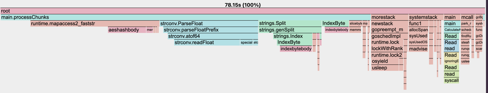

# 1brc in go

This is a go implementation of the [1brc](https://github.com/gunnarmorling/1brc) challenge.


### Runtime

| implementation                              | time           |
|---------------------------------------------|----------------|
| simple implementation                       | 1m17.47s       |
| using bufio.Reader with buffer size `1<<10`   | 1m9.42s |
| processing in chunks with buffer size `1<<16` | 1m3.85s        |
| processing in chunks with buffer size `1<<20` | 1m2.91s        |
| processing concurrently in chunks           | 11.69s         |

### system configuration
```text
  Model Name:	MacBook Pro
  Chip:	Apple M3
  Total Number of Cores:	8 (4 performance and 4 efficiency)
  Memory:	8 GB
```

### cpu profile:


- map seems to be one of the bottlenecks. We can try exploring with a custom hash map implementation, which can store bytes itself and there would no need to convert to string while parsing.
- `strconv.ParseFloat` is also a bottleneck. This might need custom float parsing implementation.
